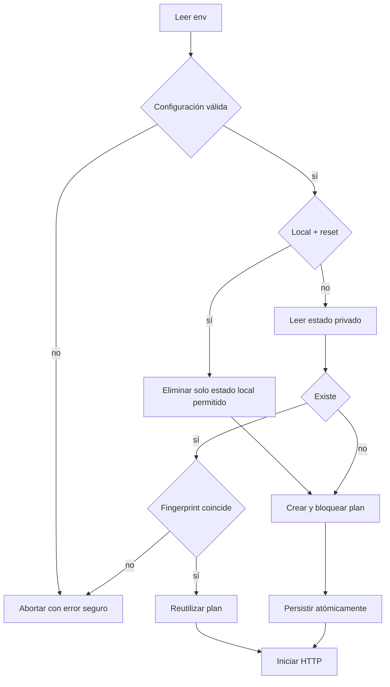
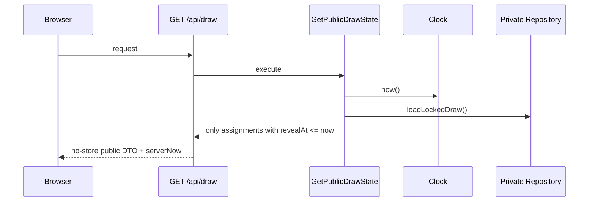

# Arquitectura del Sprint 001

## Principio

Una sola aplicación y un solo proceso propio. Firebase actúa como backend gestionado exclusivamente para el chat. El dominio del sorteo desconoce Fastify, archivos, navegador, Firebase y hora real.

```text
web ────────┐
            ├──> application ──> domain
server ─────┤          │
adapters ───┘          └──> ports

web/chat ───────────────> Firebase Auth + Firestore
```

## Componentes

### Domain

Funciones puras para validar invariantes, derivar aleatoriedad, barajar equipos/plazas, crear el plan canónico, calcular el compromiso y proyectar el estado público.

### Application

Orquesta configuración, reloj, entropía y repositorio. Carga un evento bloqueado o crea uno nuevo. No contiene HTTP ni DOM.

### Adapters

- `SystemClock`: instante actual.
- `NodeEntropy`: semilla segura mediante `node:crypto`.
- `FileDrawRepository`: estado privado con escritura temporal, `fsync` y rename atómico.

### Server

Fastify compone dependencias, sirve los assets compilados y expone solo endpoints GET.

### Web

TypeScript vanilla consulta el estado, calcula una cuenta atrás visual y renderiza mediante `textContent`. Nunca genera, modifica ni anticipa asignaciones.

### Chat gestionado

Módulos cliente aislados usan Firebase Auth anónima y Firestore. La sala no importa código del dominio del sorteo. Un error o timeout de Firebase solo cambia el estado visual del panel de chat.

## Flujo de arranque



## Flujo de lectura pública



## Estado privado

El archivo privado contiene:

- `schemaVersion`
- `algorithmVersion`
- `eventId`
- `configFingerprint`
- `lockedAt`
- `seedHex`
- `commitmentHash`
- `assignments[16]`

Se guarda fuera del directorio web, con permisos `0600`. Ningún logger serializa este objeto.

## Compromiso y verificación

1. `NodeEntropy` genera 32 bytes.
2. HMAC-SHA-256 produce flujos separados con dominios `teams` y `division-slots`.
3. El muestreo por rechazo evita sesgo de módulo.
4. Fisher–Yates baraja equipos y cuatro copias de cada división.
5. El payload canónico fija orden de campos, UTF-8, timestamps UTC y salto final.
6. `SHA-256(payload)` produce el compromiso público.
7. Antes de completar solo se expone el hash.
8. Al completar se expone el payload de verificación, incluida la semilla.

El algoritmo se etiqueta `hmac-sha256-fisher-yates-v1`. Cambiarlo exige una nueva versión y pruebas vectoriales.

## Modelo temporal

- `startAt` es un instante UTC derivado de la configuración.
- `revealAt(position) = startAt + position * interval`.
- Posiciones válidas: 1–16.
- Primera revelación: `startAt + 120 s`.
- Última revelación: `startAt + 1.920 s`.
- `status` se deriva de tiempo y conteo, no se actualiza por cron.

## API

### `GET /api/draw`

Devuelve identidad, `serverNow`, estado, progreso, hash, equipos pendientes, divisiones con asignaciones reveladas, última asignación y próxima fecha. Solo al finalizar incluye verificación.

### `GET /api/health`

Devuelve disponibilidad, `eventId` y capacidad de leer el estado. Nunca devuelve seed, plan, paths ni variables.

Todas las respuestas usan `Cache-Control: no-store`. No existen POST, PUT, PATCH o DELETE públicos.

El chat no añade endpoints Fastify. Se conecta desde el navegador a Firebase mediante configuración web pública, Security Rules y App Check.

## Sincronización cliente

- Fetch inicial obligatorio.
- Cuenta atrás visual cada segundo usando offset de servidor.
- Poll cada cinco segundos.
- Fetch adicional al llegar a cero, recuperar conexión, volver a foco o cambiar visibilidad.
- Una respuesta antigua nunca reemplaza otra con mayor `revealedCount`.
- Si falla la red, se conserva el último estado confirmado y se muestra `Reconectando…`.
- Equipos pendientes se ordenan por roster aprobado, nunca por orden secreto de revelación.

## Seguridad

- Helmet/CSP y assets del mismo origen.
- `textContent`, nunca HTML creado con nombres de equipos.
- Validación Zod para env, estado privado y DTO.
- Path privado verificado fuera de la raíz pública.
- Logs con ids, conteos y errores; nunca seed o asignaciones futuras.
- Lockfile y auditoría de dependencias en CI.
- El servidor rechaza config distinta del fingerprint persistido.
- Firestore deny-by-default, Auth obligatoria, inserts con keys exactas y update/delete denegados.
- App Check obligatorio en producción; emuladores aislados en local/CI.

## Restricción operativa

El adaptador de archivo exige una instancia escritora y volumen persistente. Es deliberado para mantener el MVP simple. Una plataforma sin esa garantía necesitará otro adaptador que respete el mismo puerto; el dominio y la UI no cambian.

Firebase añade infraestructura gestionada, pero no otro servicio operado por nosotros. El compromiso de integridad del sorteo nunca se almacena ni calcula en Firebase.

## Límite de la prueba de integridad

El hash demuestra que el plan no cambió después de publicar el compromiso. No demuestra que un operador jamás generó otro plan antes de publicar ese hash. El runbook exige capturar y comunicar el commitment antes de `T0`.
